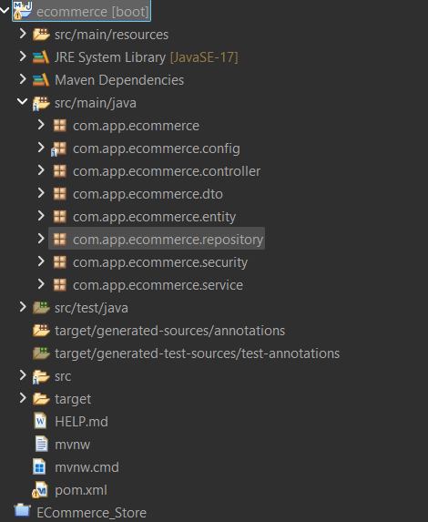
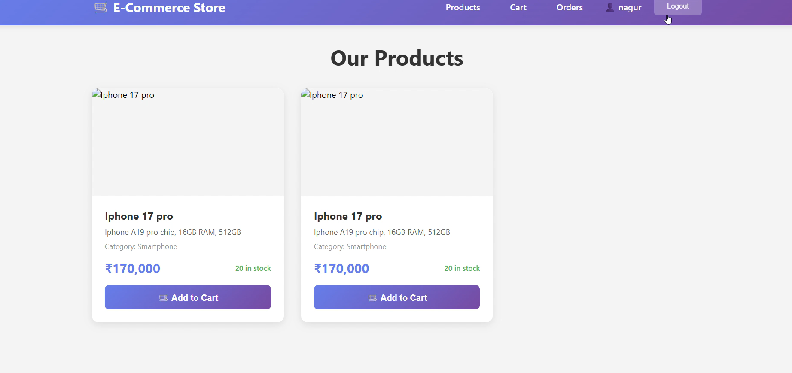
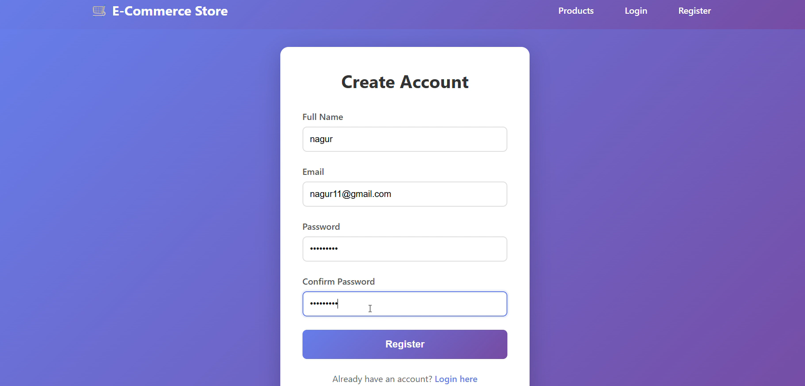
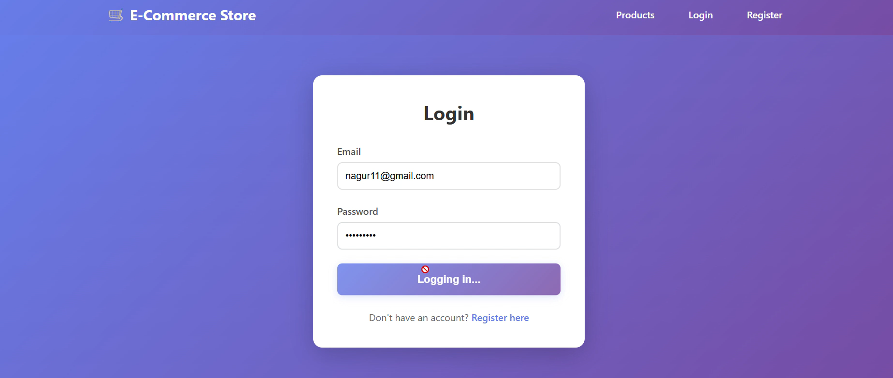

# 🛒 E-Commerce Web Application

A full-stack **E-commerce Web Application** developed as part of the **Cognetix Technology Internship Program**.  
The application enables users to browse products, manage a cart, place orders, and allows admins to manage products and users — following **industry-standard layered architecture** and **secure data handling**.

---

## 📌 Project Overview

This project simulates a **real-world online shopping platform** with core features such as:
- Product listing & search  
- Shopping cart & checkout  
- User authentication  
- Order management  
- Admin controls  

It is built to meet **internship documentation and execution standards** (objective, technical requirements, functional requirements, environment setup, and step-by-step flow) as required by Cognetix Technology.  

---

## 🎯 Objectives

- Build a **real-world e-commerce workflow**
- Implement **secure user authentication**
- Manage **products, cart, and orders**
- Store and retrieve data from a **relational database**
- Practice **full-stack web development**

---

## 🧰 Tech Stack

| Layer | Technology |
|------|------------|
| Frontend | HTML, CSS, JavaScript, Bootstrap |
| Backend | Java (Spring Boot) |
| Database | MySQL |
| ORM | Hibernate / JPA |
| API | RESTful APIs |
| Tools | IntelliJ / VS Code, Git, GitHub |

---

## 🧱 System Architecture
```
Client (Browser)
↓
Frontend (HTML, CSS, JS)
↓
Spring Boot REST API
↓
Service Layer
↓
Repository (JPA / Hibernate)
↓
MySQL Database
```


---

## 🗂️ Core Features

### 👤 User Module
- Register & Login
- Browse products
- Search & filter products
- Add to cart
- Place orders
- View order history

### 🛍️ Product Module
- View product catalog
- Product details page
- Highlighted deals & categories

### 🛒 Cart & Order Module
- Add / remove items
- Quantity management
- Checkout process
- Order confirmation

### 🔐 Admin Module
- Add, update, delete products
- Manage categories
- View users & orders

---

## 🗃️ Database Design (Example)

### `users`
| id | name | email | password | role |

### `products`
| id | name | price | category | description | stock |

### `orders`
| id | user_id | total | status | date |

### `order_items`
| id | order_id | product_id | quantity | price |

---

## ⚙️ Environment Setup

1. Install **JDK 11+**
2. Install **MySQL Server**
3. Install **IntelliJ IDEA / VS Code**
4. Install **Maven**
5. Clone the repository

```bash
git clone https://github.com/nagur18/ecommerce-web-app.git
```

## ▶️ How to Run
1️⃣ Configure Database

Create MySQL database

Update application.properties with DB credentials

2️⃣ Run Backend
```
mvn spring-boot:run
```
3️⃣ Open Frontend

Open index.html or access via:
```
http://localhost:8080
```

## 📸 Application Screenshots

### 🏠 Structure


### 🏠 Main Dashboard


### ➕ Register page


### 📋 Login Page



## 🧪 Testing Checklist

User registration & login

Product listing

Add to cart

Place order

Admin product management

## 📁 Project Structure
```
ecommerce-web-app/
│
├── src/main/java
│   ├── controller
│   ├── service
│   ├── repository
│   ├── model
│
├── src/main/resources
│   ├── application.properties
│   └── templates / static
│
└── pom.xml
```
## 🏆 Internship Compliance

This project satisfies the Cognetix Technology Internship requirements by including:

Real-world project

Technical & functional implementation

Database integration

Step-by-step execution

GitHub submission & documentation

## 👨‍💻 Author

* Nagur Vali
* Full Stack Developer Intern
* Cognetix Technology

## 📜 License

This project is developed for educational and internship purposes under Cognetix Technology.


